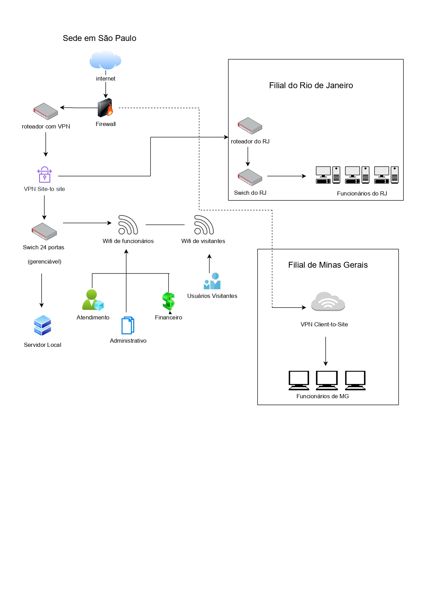

# Desafio Final-Módulo 1 -Karyne Guinyver Dias da Silva

## Sumário Executivo

A empresa Fictício S/A atua no setor financeiro e precisa de uma rede segura, eficiente e escalável.Sua operação envolve uma matriz em São Paulo e duas filiais, que devem estar conectadas e protegidas.O principal desafio é garantir que cada setor tenha acesso controlado e que os dados sensíveis estejam protegidos.Para isso, a proposta utiliza VLANs, que são redes virtuais que isolam departamentos dentro da mesma estrutura física.
 Além disso, implementa-se um firewall,que é basicamente uma parede de fogo, dispositivo que controla o tráfego de dados para impedir acessos indevidos .Para conexões remotas, será usada a VPN, ou rede privada virtual, que cria um túnel seguro na internet para o acesso remoto.Também será feita integração com serviços em nuvem, que são plataformas online para armazenar e acessar dados remotamente.Essas soluções combinadas permitem que a empresa tenha controle dos acessos, isolamento dos setores e segurança. Ao mesmo tempo, a rede suportará o crescimento da empresa, com escalabilidade e desempenho otimizados para todos os usuários.

## Objetivo

O objetivo deste projeto é criar uma arquitetura de rede corporativa moderna e eficiente para a Fictício S/A. Essa rede terá foco na segurança, garantindo a proteção dos ativos mais importantes da empresa.Além disso, será projetada para otimizar o desempenho na comunicação entre os diferentes setores e filiais do Rio de Janeiro e Minas Gerais. Um controle rigoroso de acessos será implementado, com políticas claras que segmentam a rede por departamentos.Para permitir o trabalho remoto seguro, será utilizada a VPN, que protege a conexão dos usuários externos. Por fim, a rede será pensada para ser escalável, acompanhando o crescimento e as necessidades futuras da empresa.

## Escopo

O projeto abrange a criação da rede para as três unidades da empresa Fictício S/A, garantindo segurança e eficiência. Na matriz, localizada em São Paulo, a rede suportará 80 funcionários distribuídos em quatro departamentos principais: Tecnologia, Financeiro, Atendimento e Administrativo. Nessa unidade, haverá servidores locais responsáveis por sistemas essenciais, como o planejamento dos recursos da empresa, que gerencia processos empresariais, além de armazenamento de arquivos e serviços de impressão.A matriz também contará com acesso à internet e integração com serviços em nuvem, como o Microsoft Office 365 e sistemas de gestão de relacionamento com o cliente, para otimizar a produtividade.
Para a conectividade sem fio, serão disponibilizadas redes Wi-Fi separadas: uma para os funcionários criando assim uma intranet que nada mais é do que rede uma interna privada, usada apenas por funcionários de uma empresa, e outra isolada para visitantes, garantindo segurança e controle de acesso. 
Na filial do Rio de Janeiro, com 30 funcionários, a estrutura será semelhante à matriz, porém em menor escala, mantendo os mesmos departamentos e serviços básicos.Essa filial estará conectada permanentemente à matriz por meio de uma VPN site-to-site, que cria um canal seguro e criptografado entre as unidades para troca de dados.
Já a filial de Minas Gerais, com 10 funcionários, necessitará de acesso remoto seguro aos sistemas da matriz.Para isso, será implementada uma VPN client-to-site, que permite que usuários remotos se conectem à rede da matriz com segurança, como se estivessem localmente no escritório.Assim, o projeto cobre todas as necessidades das unidades, garantindo comunicação segura, isolamento adequado e facilidade de acesso remoto.

## Metodologia

Para o desenvolvimento deste projeto, iniciou-se com a análise detalhada do briefing fornecido pela empresa Fictício S/A. Essa análise permitiu identificar os principais requisitos funcionais e de segurança necessários à rede. A seguir, foram selecionadas soluções de infraestrutura que equilibrassem custo, desempenho e proteção de dados.
A arquitetura foi desenhada com base em boas práticas de redes corporativas, como segmentação por VLANs, uso de firewalls e integração com VPNs. Além disso, foram utilizados conceitos de escalabilidade, garantindo que o sistema possa crescer junto com a empresa.
O diagrama da rede foi criado utilizando ferramentas específicas de modelagem gráfica, e todas as decisões técnicas foram validadas com foco em eficiência operacional, facilidade de gestão e segurança. O plano de ação foi elaborado com base no princípio de Pareto (80/20), priorizando medidas de alto impacto com menor esforço de implementação.

## Proposta de Arquitetura

A proposta apresenta uma arquitetura de rede funcional e econômica, alinhada às necessidades da Fictício S/A e ao custo-benefício , pois é um projeto relativamente acessível e escalável  .
A segmentação será feita por VLANs para garantir o isolamento dos departamentos, mas com uma estrutura simplificada para reduzir custos.
Teremos VLANs principais para Tecnologia (TI), Financeiro, Atendimento, Administrativo, visitantes e servidores internos, garantindo organização e segurança.
Para conectar a matriz à filial RJ, será utilizada uma VPN site-to-site simples, utilizando equipamentos que ofereçam segurança sem custos elevados, visando a economia dos ativos empresariais .
O acesso remoto da filial MG será feito via VPN client-to-site, com soluções acessíveis e de fácil configuração para o time remoto.
O firewall será básico, mas eficiente, com listas de controle de acesso para restringir o tráfego entre VLANs, evitando acessos indevidos.
O monitoramento e filtragem de tráfego para internet e nuvem serão feitos com políticas simples, priorizando serviços essenciais como Office 365 e de relacionamento com clientes.
Para a conectividade com a nuvem, será adotado acesso direto com regras mínimas, visando preservar a segurança sem investimentos complexos.
Essa abordagem mantém a rede segura e funcional, reduzindo gastos com equipamentos avançados e serviços complexos, oferecendo um ótimo custo-benefício.
A rede utiliza topologia híbrida, com a matriz em SP como ponto central. As filiais RJ e MG se conectam por VPN site-to-site, garantindo comunicação segura entre as unidades. O acesso remoto em MG usa VPN client-to-site, permitindo conexões externas protegidas. O diagrama mostra os principais dispositivos (roteadores, switches, firewalls e PCs), destacando uma estrutura segura, escalável e organizada por localidade

## Diagrama de Rede

## Diagnóstico

A proposta apresenta uma arquitetura de rede funcional e econômica, alinhada às necessidades da Fictício S/A. A segmentação será feita por VLANs para isolar os departamentos e manter segurança interna. Teremos VLANs para TI, Financeiro, Atendimento, Administrativo, visitantes e servidores. A conexão entre matriz e RJ será via VPN site-to-site, e o acesso da filial MG via VPN client-to-site. Firewalls com ACLs controlarão o tráfego interno. A internet e nuvem terão políticas simples, priorizando serviços essenciais. O projeto reduz custos e garante funcionalidade e proteção adequadas à empresa.

## Recomendações

Realizar manutenção preventiva dos equipamentos e atualizar os firmwares periodicamente.
Promover treinamento da equipe de TI sobre gerenciamento de rede, firewall e segurança.
Utilizar ferramentas de monitoramento contínuo para identificar falhas ou ataques.
Revisar políticas de acesso regularmente conforme alterações no quadro de pessoal.
Avaliar futuramente a redundância de link de internet para a matriz.
Fazer auditorias de segurança periódicas para garantir conformidade com boas práticas.
Implementar backups criptografados automáticos dos dados e sistemas críticos.
Analisar a escalabilidade anual da rede, acompanhando o crescimento da empresa.

## Justificativas Técnicas

A segmentação da rede por VLANs foi escolhida porque ela cria redes separadas dentro da mesma infraestrutura física,o que ajuda a evitar que problemas ou ataques em um departamento afetem os outros setores da empresa. Ou seja, se um departamento sofrer um ataque, a rede dos outros não é afetada e o tempo de reparo diminui, já que o sistema não é comprometido totalmente.
O uso da VPN garante que as informações trocadas entre a matriz e as filiais sejam criptografadas, ou seja, protegidas,impedindo que pessoas não autorizadas tenham acesso a esses dados enquanto trafegam pela internet.
O firewall com listas de controle de acesso permite definir exatamente quem pode acessar o quê dentro da rede,ajudando a controlar o tráfego entre os departamentos e protegendo o ambiente contra acessos indevidos.Sendo assim os departamentos se mantêm seguros e um funcionário sem acesso ou credenciais não poderá comprometer o sistema .
Para o Wi-Fi, foi criado um acesso separado para visitantes, o que impede que dispositivos externos se conectem à rede interna,evitando riscos de segurança causados por dispositivos desconhecidos. A empresa possuirá uma intranet onde os visitantes não têm acesso pois é um sistema interno.
Por fim, manter os servidores na matriz melhora o desempenho dos sistemas essenciais e garante que os dados mais importantes fiquem sob controle direto da empresa, facilitando a gestão e segurança da informação.

## Plano de Implementação

O plano de ação prioriza as medidas que trazem maior impacto com custos e esforços equilibrados, garantindo segurança eficiente.Primeiro, a implementação das VLANs por departamento é essencial para organizar e proteger a rede, com investimento moderado e alta eficácia. Em seguida, a configuração da VPN site-to-site entre matriz e filial RJ assegura comunicação segura permanente, usando soluções acessíveis e confiáveis.
A implantação da VPN client-to-site para a filial MG garante acesso remoto protegido, com custo baixo e facilidade de uso para o time externo.
Criar uma política clara para o Wi-Fi de visitantes isola esses acessos, prevenindo riscos, com investimento mínimo e implementação simples.
Ativar o firewall com listas de controle de acesso entre as VLANs reforça a segurança, controlando o tráfego interno sem custos elevados.Por fim, documentar todas as políticas de acesso é fundamental para garantir a continuidade da segurança e facilitar a gestão da rede. Este projeto traz um equilíbrio entre segurança, funcionalidade e custo-benefício, preparando a empresa para crescer sem comprometer a proteção dos dados.

| Ação                               | Impacto | Facilidade | Prioridade |
| ---------------------------------- | ------- | ---------- | ---------- |
| Implementar VLANs por departamento | Alto    | Média      | Alta       |
| Configurar VPN site-to-site (RJ)   | Alto    | Alta       | Alta       |
| Implantar VPN client-to-site (MG)  | Médio   | Alta       | Média      |
| Criar política de Wi-Fi visitantes | Médio   | Alta       | Média      |
| Ativar firewall entre VLANs        | Alto    | Média      | Alta       |
| Documentar políticas de acesso     | Médio   | Alta       | Média      |

## Conclusão

A proposta apresentada atende de forma eficaz às necessidades da Fictício S/A, oferecendo uma rede segura, organizada e escalável. A segmentação por VLANs proporciona isolamento entre os departamentos, enquanto as conexões VPN garantem comunicação segura entre matriz e filiais. A adoção de políticas de acesso, firewall e Wi-Fi separado para visitantes reforça a proteção dos dados e da infraestrutura.
Além disso, o projeto foi desenhado com foco em custo-benefício, utilizando soluções acessíveis que não comprometem a segurança nem o desempenho. O plano de ação estruturado facilita a implementação por etapas, maximizando os resultados com investimentos controlados. Dessa forma, a rede proposta não só atende às demandas atuais, como também está preparada para acompanhar o crescimento futuro da empresa.

